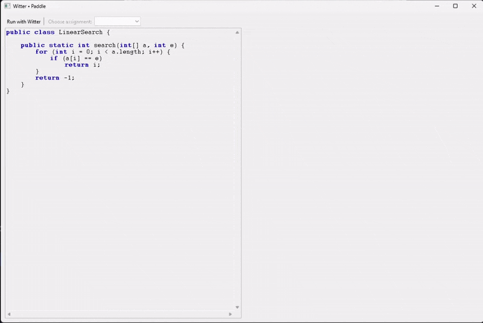

<div align="center">

# Witter

**A Library for White-Box Testing of
Introductory Programming Algorithms**

[](https://doi.org/10.1145/3622780.3623650)

**Witter** is a software testing library that allows programming instructors to define white-box
tests for Java source code. Witter analyzes the execution of a method against a reference
solution, to verify that the code not only produces correct results but is also in
accordance with a desired algorithm behaviour.

[Installation](#installation) •
[Specifying reference solutions](#specifying-reference-solutions) •
[Testing arbitrary solutions](#testing-arbitrary-solutions) •
[Examples](#examples)

</div>

<br>

## Installation
**Witter** is an experimental library, and as such is not yet available in build automation tools (Gradle, etc.)

To use Witter in your project, first build its .jar file using Gradle's build task. The .jar file is generated under
the project root in `/build/libs`. This file should be copied to your own project's `libs` folder,
and then added as a dependency in your build automation tools. For example, in Gradle:
```kotlin
dependencies {
    implementation(files("libs/witter-0.3.0.jar"))
}
```
Note, of course, that the file name can change when updates for Witter are released, and should be changed
in your dependency specification accordingly.

You may additionally need to specify dependencies for the 
[Strudel](https://github.com/andre-santos-pt/strudel) and 
[ANTLR](https://www.antlr.org/) libraries.

<br>

## Specifying reference solutions
One can define the test cases for a given exercise by writing
a reference solution in a Java method, annotated with a
header comment that defines the different test inputs and
the metrics that should be measured during test execution.
The content of the comments has to obey Witter’s Test Specification
Language (TSL), whose syntax is similar to Java’s
annotation syntax:
```java
/*
@Test(new int[] { 1, 2, 3, 4, 5 })
@Test(new int[] { 2, 4, 6 })
@CountLoopIterations
@CountArrayReads
@CheckSideEffects
*/
public static int sum(int[] a) { 
    ... 
}
```

Witter currently supports the following runtime metrics.

| **Metric**         | **Annotation**                      | **Verification**                                                                                  |
|--------------------|-------------------------------------|---------------------------------------------------------------------------------------------------|
| Return values      | @Test(_[...args]_)                  | Return value is equal to reference solution. Multiple annotations can be used.                    |
| Side effects       | @CheckSideEffects                   | Side effects on arguments (presence and absence) are the same to those of the reference solution. |
| Loop iterations    | @CountLoopIterations(_[threshold]_) | Total number of loop iterations matches the one of the reference solution.                        |
| Array allocations  | @CheckArrayAllocations              | The array allocations match those of the reference solution (component types and lengths).        |
| Array reads        | @CountArrayReads(_[threshold]_)     | The number of array read accesses is the same as in the reference solution.                       |
| Array writes       | @CountArrayWrites(_[threshold]_)    | The number of array write accesses is the same as in the reference solution.                      |
| Object allocations | @CheckObjectAllocations             | The number of object allocations and their types match those of the reference solution.           |
| Recursive calls    | @CountRecursiveCalls(_[threshold]_) | The number of recursive calls matches the one of the reference solution.                          |

<br>

## Testing arbitrary solutions
As Witter is designed for third-party integration, it provides
a form of executing the tests programmatically. Tests are executed providing an annotated reference
solution as described, and a solution that one wishes to assess:
```java
Test test = new Test("ReferenceSolution.java");
        
List<TestResult> results = test.execute("Solution.java");
```

The test results consist of a list of feedback
items for each aspect defined in the test specification,
holding the following information:
- a flag indicating success or failure;
- which kind of metric has failed (recall Table 1);
- the location of code elements involved in the failed tests (e.g., procedure, parameters, loop structures);
- a human-readable descriptive feedback message.

<br>

## Examples
<details>
<summary><b>Factorial (recursive)</b></summary>

Reference solution with recursion:
```java
/*
@Test(5)
@CountRecursiveCalls(1)
*/
static int factorial(int n) {
    if (n == 0) return 1;
    else return n * factorial (n - 1);
}
```

Solution under testing (iterative, with a defect):
```java
static int factorial(int n) {
    int f = 1;
    for (int i = 0; i <= n; i++)
        f *= i; // i starts at 0, f always 0
    return f;
}
```

Witter test results (black-box and white-box fail):
```
[fail] factorial(5)
    Expected result: 120
    Found: 0

[fail] factorial(5)
    Expected recursive calls: 4 (± 1)
    Found: 0
```
</details>

<br>

<details>
<summary><b>Binary search (iterative)</b></summary>

Reference solution using binary search:
```java
/*
@Test(new int[] { 1, 2, 3, 4, 5, 6, 7 }, 1)
@Test(new int[] { 1, 3, 7, 9, 11, 13, 17, 19 }, 18)
@CountLoopIterations
@CheckSideEffects
*/
static int binarySearch (int[] a, int e) {
    int l = 0;
    int r = a. length - 1;
    while (l <= r) {
        int m = l + (r - l) / 2;
        if (a[m] == e) return m;
        if (a[m] < e) l = m + 1;
        else r = m - 1;
    }
    return -1;
}
```

Solution under testing (performing linear search):
```java
static int binarySearch (int[] a, int e) {
    for (int i = 0; i < a. length ; i++)
        if (a[i] == e) return i;
    return -1;
}
```

Witter test results (black-box pass, white-box fail):
```
[pass] search([1, 2, 3, 4, 5, 6, 7], 1)
	Expected result: 0 

[fail] search([1, 2, 3, 4, 5, 6, 7], 1)
	Expected loop iterations: 3 
	Found: 1

[pass] search([1, 2, 3, 4, 5, 6, 7], 1)
	Expected side effects of a: [1, 2, 3, 4, 5, 6, 7] 
	
[pass] search([1, 2, 3, 4, 5, 6, 7], 1)
	Expected side effects of e: 1

[pass] search([1, 3, 7, 9, 11, 13, 17, 19], 18)
	Expected result: -1 

[fail] search([1, 3, 7, 9, 11, 13, 17, 19], 18)
	Expected loop iterations: 4 
	Found: 8

[pass] search([1, 3, 7, 9, 11, 13, 17, 19], 18)
	Expected side effects of a: [1, 3, 7, 9, 11, 13, 17, 19]
	
[pass] search([1, 3, 7, 9, 11, 13, 17, 19], 18)
	Expected side effects of e: 18
```
</details>

<br>

<details>
<summary><b>Insertion sort (procedure)</b></summary>

Reference solution performing insertion sort:
```java
/*
@Test(new int[] { 5, 4, 3, 2, 1 })
@CountArrayReads
@CountArrayWrites
@CheckSideEffects
*/
static void sort(int[] a) {
    for (int i = 1; i < a. length; i++) {
        for (int j = i; j > 0; j--) {
            if (a[j] >= a[j - 1]) break;
            int tmp = a[i];
            a[i] = a[j];
            a[j] = tmp;
        }
    }
}
```

Solution under testing (performing selection sort):
```java
static void sort(int[] a) {
    for (int i = 0; i < a. length - 1; i++) {
        int min = i;
        for (int j = i + 1; j < a. length ; j++)
            if (a[j] < a[min]) min = j;
        int tmp = a[i];
        a[i] = a[min];
        a[min] = tmp;
    }
}
```

Witter test results (black-box pass, white-box fail):
```
[fail] sort([5, 4, 3, 2, 1])
	Expected array reads: 40 
	Found: 28

[fail] sort([5, 4, 3, 2, 1])
	Expected array writes: 20 
	Found: 8

[pass] sort([5, 4, 3, 2, 1])
	Expected side effects of a: [5, 4, 3, 2, 1] 
```
</details>

<br>

## See it in action 😎
The following is an example of how Witter could be integrated into an existing
development system, using a simple GUI custom-made for example purposes.



<br>

## Citation
If you use or reference Witter in your academic work, you should cite the following paper.

**ACM Reference Format**
> Afonso B. Caniço and André L. Santos. 2023. Witter: A Library for
White-Box Testing of Introductory Programming Algorithms. In
_Proceedings of the 2023 ACM SIGPLAN International Symposium
on SPLASH-E (SPLASH-E ’23), October 25, 2023, Cascais, Portugal._
ACM, New York, NY, USA, 6 pages. https://doi.org/10.1145/3622780.3623650

**BibTeX**
```
@inproceedings{canicosantos2023,
    author = {Cani\c{c}o, Afonso and Santos, Andr\'{e}},
    title = {Witter: A Library for White-Box Testing of Introductory Programming Algorithms},
    year = {2023},
    isbn = {9798400703904},
    publisher = {Association for Computing Machinery},
    address = {New York, NY, USA},
    url = {https://doi.org/10.1145/3622780.3623650},
    doi = {10.1145/3622780.3623650},
    abstract = {Software testing is mostly performed in a black-box manner, that is, without incorporating any knowledge of the internal workings of programs into the tests. This practice usually suffices for enterprises and general practitioners, where the focus lies on producing reliable results while most algorithmic tasks are provided by third-party libraries. However, for computer science students and the like, it might not be straightforward to discern the underlying causes of an incorrect test result or to understand why certain algorithmic goals are not met. We present Witter, a software testing library that allows programming educators to define white-box tests for Java source code. Our tests analyze the execution of a method against a reference solution, to verify that the code not only produces correct results but is also in accordance with a desired algorithm behavior.},
    booktitle = {Proceedings of the 2023 ACM SIGPLAN International Symposium on SPLASH-E},
    pages = {69–74},
    numpages = {6},
    keywords = {programming education, white-box testing, feedback, assessment},
    location = {Cascais, Portugal},
    series = {SPLASH-E 2023}
}
```

<br>

## Contacts
If you have any questions regarding Witter, its development process, or the related academic
publication, feel free to contact the authors:
- Afonso B. Caniço - [ambco@iscte-iul.pt](mailto:ambco@iscte-iul.pt)
- André L. Santos - [andre.santos@iscte-iul.pt](mailto:andre.santos@iscte-iul.pt)